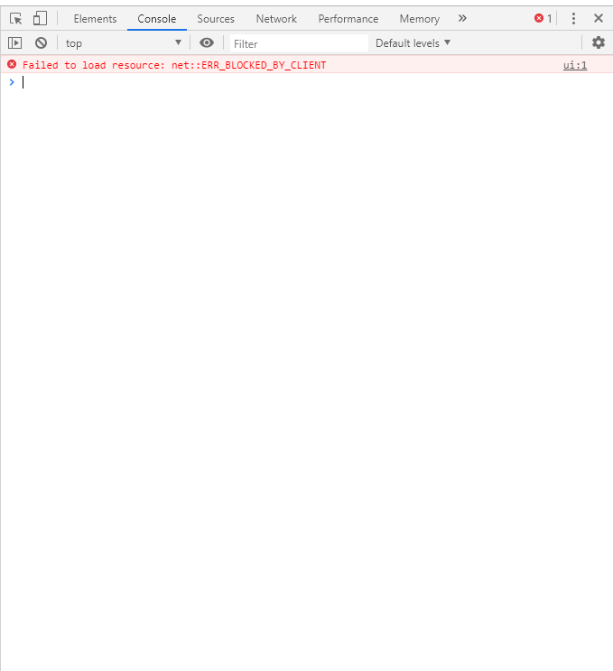

# JS D1 190430 火曜日 memo

## Java Script

* 움직임을 구현하기 위해 고안된 역할.

* 자바와 이름만 비슷한 거고 전혀 다른 언어이다.(햄과 햄토리 같은 관계)

##### 브라우저의 역사(간단요약)

처음은 Netscape가 브라우저의 간판이었지만 윈도우98의 보급과 함께 같이 설치되어있는 익스플로러가 대세를 뒤집었었다. 
점유율이 떨어진 Netscape는 현재, firefox가 netscape의 정신을 잇는 브라우저로서 활동하고 있다.

netscape와 explorer가 경쟁하고 있을 당시 프로그래밍 언어가 상호호환되지 않았다.
그 둘의 언어가 바로 javascript 와 jscript.
이 둘은 대항마 관계라 서로 같이 적용된 경우가 적었다.
그래서 브라우저별로 들어갈 수 있는 사이트가 달랐다.
=>[크로스 브라우징 이슈]

그 이후로, ''같은 언어로 작성한거면 모든 브라우저에서 실행되게끔하자. ''고 합의해서 생긴 게 [ES]
ES = ECMA Script. 
1997年에 ES1으로 시작해서 가장 많이 쓰는 게 ES2015 버전이다.

### Vanilla JS

* 순수상태의 자바스크립트를 뜻함. (브라우저 내에 동작하는 언어이기 때문에 설치할 필요가 없다.)

* 이 언어를 기준으로 오늘 설명할 예정!


#### 자바스크립트의 역할(이해 못함.)

1. DOM (Document of Model)
   HTML??
2. BOM (Browser of Model)
3. JavaScript 
   Object, Array, Function


##### 자바스크립트의 인터프리터! 그 맛뵈기.



```javascript
window.innerWidth 	# 현재 창의 가로너비 측정.
window.print();		# 인쇄
window.open();		# 새 창 열기
window.document.title;	# 현재창 문서 제목 보기
window.document.title = 'JavaScript';	# title에 새로운 값을 할당.
```

* 이 콘솔로 일반적인 프로그래밍 언어도 활용가능하다.

 브라우저의 대세가 익스에서 크롬으로 바뀌는 이유는 빠르고 웹표준을 지켰기 때문이라는 게 중론이다.

V8엔진이 자바스크립트를 좋은 성능으로 구현하다 보니 자바스크립트를 쓰는 일이 많아졌고
서버에서도 자바스크립트를 개발 할 수 있게 해보자 해서 나온 게 node.js가 출현.
!즉, 자바스크립트를 하나 배우면 웹을 온전히 만들수 있다.!

* vue.js = 웹 프레임워크

##### 맛보기 코드(Console에 작성)

* 콘솔은 자바스크립트 명령어를 자동완성시킬 수 있다.

```javascript
document.querySelector('h1')	# 괄호안의 태그를 가져올 수 있음.
<h1>​hello world​</h1>​			# h1태그 결과 출력.
document.querySelector('h1').innerText	# 안에 있는 텍스트만 출력
document.querySelector('h1').innerText = "Bye, man!"	# 내용 할당.
document.write(word)	# 문서에 글을 새로 씀.괄호 안은 변수

```

##### 작성 기본 지식

```javascript
<head>
    <!-- JS 위치 1 head는 순서가 상관 없음.-->
</head>
<body>
    <!-- JS 위치 2 body 가장 마지막 부분에 위치-->
   <script>
   </script>
</body>
```


#### 기초 작성

```javascript
<script> // 브라우저 조작, 돔 조작을 쓸 공간. 
        /*
            여러 줄의 주석.
            This is Comment
        */
        alert('Welcome to JS!') // 알람을 띄움.

        // 문서에 출력하기
        document.write('<h1>Hello, World!</h1>')

        // 변수 선언
        // let : 재할당 가능
        let word1 = '외안되' // let은 새로운 값을 할당 할 수 있어요.
        document.write(word1);

        // const : 재할당 불가능    상수로서 이 변수를 정의.
        const word2 = '외안되'
        document.write(word2)
        /*
        const word2
        word2 = '아무 내용'  이런 형식(여러 줄)으로 프로그래밍이 되지 않음.
        */
        
        // word = '왜안돼'
        // document.write(word)

        const firstName = 'happy'   // const에 문자도 가능.
        const lastName = 'hacking'
        const fullName = firstName + lastName   // '+'를 통해서 두 개의 문자열을 더할 수 있음.
        document.write('<h1>' + fullName + '!!' + '</h1>')
        document.write(`<h1>${fullName}!!</h1>`)  //백틱을 이용.포매팅이 가능. : Template Literal
//	$를 통해 변수 또는 연산 값을 집어넣을 수 있음. ES6부터 사용 가능.

        // console에 출력하기
        console.log(`Console : ${fullName}`)      

    </script>
```

---

##### input 과 유사한 prompt라는 함수.

사용자로부터 입력을 받을수 있도록 하는 메소드.

* 네이밍 컨벤션??
  무슨 뜻일까?

```javascript
        // 사용자 입력 받기
        // Python : user_name (snake_case)
        // JS : userName (CamelCase)    관용화 되어있는 변수명 짓는 방법.
        const userName = prompt('Hello! Who are you?')
        let message = `<h1>Hello ${userName}</h1>`

        document.write(message)
```

#### 조건문

```javascript
        let message = ''
        // if문,  // if 문은 '=' 3개, 괄호와 중괄호 필요하고 else if 줄이지 말고 써야한다.
        if (userName === '') {
            message = '<h1>This is secret Admin page</h1>'
        } else if (userName === 'nwith') {
            message = '<h1>No water in the house?</h1>'
        } else {
            message = `<h1>Hello ${userName}</h1>`
        }

		// == vs. ===
        // == : '값'만 비교 (ex. 0 == "0" 는 true)
        // === : '값' & '타입' 비교 (ex. 0 === "0" 는 false)    strict 비교 연산자.


        // 삼항 연산자	조건문 ? 참값 : 거짓값
        const number = 10
        number === 10 ? document.write('number === 10') : document.write('number !== 10')
```

##### 세미콜론 테스트

* javascript 는 ;(세미콜론)을 넣어도 되고 안 넣어도 된다.
* 다만, 세미콜론이 없으면 오류가 발생하는 경우가 있다.

```javascript
		// 세미콜론 테스트
        const a = 1
        const b = 2
        const c = a + b;

        (a+b).toString()
        // 줄을 띄워도 한 줄로 인식하기 때문에 변수 선언 이후 바로 수식이 들어가면 세미콜론으로 분기점을 만들어주자.
```

##### 콘솔입력된 내용을 저장하기 위한 Node.js 설치.

<https://nodejs.org/ko/>

```bash
node	# 노드 실행.
> .exit # 노드 종료.
undefined	# 바로 윗줄에 대한 반환 값이 없다. 는 뜻.(신경 쓸 필요 X)
```

```bash
$ node
# 기본 변수 지정 및 연산.
> let a = 1
undefined
> let b = 2
undefined
> let c = a + b
undefined
> a
1
> b
2
> c
3
> c = c+10
13
> c += 10
23
> c += 1
231
> c++	# 출력하고 증가
231
> c
232
> ++c	# 증가하고 출력
233
> --c
232
> c
232
> c--
232
> c
231
> d = c--	# 요고요고 유용하게 쓰일 것임!
231
> f = --c
229
```


#### 반복

반복 1 - while

```javascript
// 반복 1 - while
let i = 0
while (i < 10) {
    console.log(i)
    i++
}
```

```bash
$ node 0430.js
0
1
2
3
4
5
6
7
8
9
```

반복 2 - for

```javascript
// 반복 2 - for
for (let j=0; j < 10; j++) {
    console.log(j)
}
```

반복 3 - for of

```javascript
// 반복 3 - for of	반복가능한 리스트를 이용해 반복.
for (let number of [1,2,3,4,5]) {   // const로도 선언 가능
    console.log(number)
}
```


#### 배열(Array)

* ##### node.js는 음수값은 지원하지 않고 양수값만 지원한다.

```javascript
# 0430.js
// Array (배열)
const numbers = [1,2,3,4]

console.log(numbers[0])
console.log(numbers[-1])
-----
1
undefined
```

```bash
$ node
> const numbers = [1,2,3,4]
undefined
> numbers[0]
1
> numbers[1]
2
> numbers[2]
3
> numbers.length		# 길이
4
> numbers.reverse()		# 뒤집기
[ 4, 3, 2, 1 ]
> numbers
[ 4, 3, 2, 1 ]
> numbers.reverse()
[ 1, 2, 3, 4 ]
> numbers
[ 1, 2, 3, 4 ]
> numbers.push('a')	# 요소 삽입
5		# numbers.length(길이 반환)
> numbers
[ 1, 2, 3, 4, 'a' ]
> numbers.pop()		# 요소 삭제
'a'
> numbers
[ 1, 2, 3, 4 ]
> numbers.unshift('a')	#왼쪽에 삽입
5
> numbers
[ 'a', 1, 2, 3, 4 ]
> numbers.shift()	# 왼쪽 요소 삭제
'a'
> numbers
[ 1, 2, 3, 4 ]
> numbers.includes(1)	# 포함되어있는지 여부를 탐색
true
> numbers.includes(0)
false
> numbers.push('a')
5
> numbers.push('a')
6
> numbers
[ 1, 2, 3, 4, 'a', 'a' ]
> numbers.indexOf('a')	# 왼쪽에서 부터 탐색함.
4
> numbers.indexOf('b')	
-1	# 값을 못 찾으면 -1 반환
> numbers.join()	# 쉼표로 구분하여 문자열 출력. 원본을 헤치지 않음.
'1,2,3,4,a,a'
> numbers.join('')
'1234aa'
> numbers.join('-')
'1-2-3-4-a-a'
> numbers.slice(2, 4)	# 중간 구간(시작점, 끝점)을 길게 출력.
[ 3, 4 ]	# 배열의 요소(0부터 시작하여 2번째, 3번째 값) 출력
> numbers.slice(2)	# 2부터 끝까지
[ 3, 4, 'a', 'a' ]
> 'abcd'.slice(2)
'cd'
> numbers.filter(function(x){ x>1 })
[]
> numbers.filter(function(x){ return x>1 })
[ 2, 3, 4 ]
```


#### 객체(Object)

* 파이썬의 딕셔너리에 해당.
* {} : 오브젝트라고 부름.

```javascript node
> const me = {
... name: 'nwith',	# 따옴표가 꼭 필요하지 않다.
... 'phone number': '01012345678',	# 단어 두개를 문자열로 나열하려면 따옴표가 필요하다.
... appleProducts: {
..... ipad: true,
..... iphone: 'X'
..... }
... }
undefined
> me
{ name: 'nwith',
  'phone number': '01012345678',
  appleProducts: { ipad: true, iphone: 'X' } }
> me['name']	# 문자열이기 때문에 따옴표를 표기해야 한다.(대괄호를 통해서 불러올 때)
'nwith'
> me['phone number']
'01012345678'
> me.name	# 띄어쓰기에 한해서만 호출할 수 있다.
'nwith'
> me.appleProducts
{ ipad: true, iphone: 'X' }
> me.appleProducts.ipad
true
> me.appleProducts.iphone
'X'
```

##### 객체(Object) 와 JSON 변환

```javascript
// Object 
const me = {
    name: 'nwith',
    'phone number': '01012345678',
    appleProducts: {
        ipad: true,
        iphone: 'X'
    }
}

// JSON - JavaScript Object Notation (JS 객체 표기법)
JSON.stringify()    // Object -> JSON String

JSON.parse()    // JSON String -> Object

```

```javascript
# bash - node.js
> const jsonData = JSON.stringify(me)
undefined
> jsonData
'{"name":"nwith","phone number":"01012345678","appleProducts":{"ipad":true,"iphone":"X"}}'
> typeof jsonData
'string'
> const parseData = JSON.parse(jsonData)	#String이 딕셔너리 형태여야 .parse()메소드가 적용됨.
undefined
> parseData
{ name: 'nwith',
  'phone number': '01012345678',
  appleProducts: { ipad: true, iphone: 'X' } }
> typeof parseData
'object'

```

#### 함수

```javascript
# 0430.js
// 함수
// 방법 1 - 선언식
function add(num1, num2) {	# 반드시 괄호 안에 파라미터 있어야 함.
    return num1 + num2	# return 키워드를 명시해야 됨.
}
console.log('add: ' + add(1,2))

// 방법 2 - 표현식
const sub = function (num1, num2) {
    return num1 - num2
}
console.log('sub: '+ sub(5, 3))

typeof add // function
typeof sub // function

// Arrow Function - ES 6 들어서 새로 생긴 기능(핵심적이지만 일단 알아두는 정도로 생각)

// 기존 방법
const mul = function (num1, num2) {
    return num1 * num2
}

// Arrow
const mul = (num1, num2) => {
    return num1 * num2
}

let square = (num) => { 
    return num ** 2 
}

// return문 단 한줄이면 {} & return 생략 가능. square는 위에 있기 때문에 let을 생략한 것일 뿐.
square = (num) => num ** 2

// () 안의 인자가 하나뿐이면 ()도 생략 가능. 인자가 0개 일때는 생략 불가능.
square = num => num ** 2
let noArgs = () => 'No args'

// Object를 return한다면? 괄호가 없으면 {}를 함수의 {}로 인식하기 때문에 ()가 필요! 
let returnObject = () => ({key:'value'})
-------

// 함수의 기본 인자
const sayHello = (name='noName') => `hi ${name}` // hi noName 으로 출력됨.

sayHello('john')
sayHello()   // 기본 값을 주지 않았기 때문에 hi noName 으로 출력됨.

// 익명 함수(변수가 선언되지 않는 함수) : 호출 불가
function (num) { return num ** 3 }  // 세제곱
(num) => { return num ** 0.5 } // 제곱근

// 익명 함수 즉시 호출 : ()로 감싸면 하나의 함수가 돼버림.
(function (num) { return num ** 3})(3) // 3의 세제곱
// 가독성도 떨어지고 코드를 고의로 줄일 때 말곤 잘 안쓰임.

```


### 0422 workshop

- JS 기초 문법 학습. 
-  기존 Python 코드의 추상화 된 핵심 이해.

---

-  Python 기초 개념 코드를 JS 코드로 번역.
- 아래 Python 코드를 JS 코드로 변환해보자.. 
  Checkpoint 
  1. 브라우저는 생각하지 않는다. 
  2. 변수/함수 이름은 JS naming convention(lowerCamelCase) 을 따른다. 
  3.  F String => Template Literal.

```javascript
function concat(str1, str2) {
    return `${str1} - ${str2}`
}

function checkLongStr(string) {
    if (string.length > 10)
    	return true
	else :
    	return false
}

if (checkLongStr(concat('Happy', 'Hacking'))){
    document.write('LONG STRING')
}
else {
    document.write('SHORT STRING')
}
```

```javascript
# Answer
function concat(str1, str2) {
    return `${str1} - ${str2}`
}

function checkLongStr(string) {
    if (string.length > 10) {
        return true
    } else {
        return false
    }
}

if (checkLongStr(concat('Happy', 'Hacking'))) {
    console.log('LONG STRING')
} else {
    console.log('SHORT STRING')
}

```


### 0422 homework

*  JS 기초 문법 이해.

1. JS 는 ES6 이전과 이후로 많은 것이 바뀌었다. ES5 까지는 ‘var ‘키워드로 변수 를 선언했다면, ES6 이후로는 ‘let’ 과 ‘const’ 키워드가 등장했다. ‘let’ 과 ‘const’ 의 차이점과 언제 사용하는지 간략하게 기술하시오.

   ```
   let 은 변경이 가능한 변수 선언.
   const는 변경이 불가능한 변수 선언이다.
   const는 함수 또는 상수를 선언할 때 사용한다.
   -----
   # Answer
   let은 일반적인 변수에 사용.
   const는 한 번 할당되면 재할당을 하지 않는 경우, 보통 상수에 사용.
   기본은 const로 쓰고 만약 바뀔일이 생기면 let으로 변경해서 사용.
   오류를 최대한 줄일 수 있기 때문이다.
   ```

   

2. JS 에서는 key – value 로 이루어진 자료구조를 Object 라고 부른다. Object 와 JSON 의 차이를 간략하게 기술하시오.

   ```
   Object는 JS Engine 메모리 안에 있는 데이터 구조이고,
   JSON은 객체의 내용을 기술하기 위한 text 파일이라는 점이 다릅니다.
   ---
   # Answer
   Object는 JavaScript의 데이터 구조... 이다.
   JSON는 데이터 구조를 표현하기 위한 단순 문자열이다.
   ```

   

3. 해당 코드에서 ‘Value’ 에 접근하는 두 가지 방법(코드)을 모두 작성하시오.

   ```
   const myObject = {
   	key: 'Value'
   }
   ------------
   myObject['key']
   myObject.key
   
   
   ----
   # Answer
   위와 같음.
   ```

   

4. 아래 주석에 따라 JS 코드를 작성하시오.

```javascript
<!DOCTYPE html>
<html lang="en">
<head>
    <title>Document</title>
</head>
<body>
    <h1>Hello World!</h1>
    <script>
            // 1. h1 태그를 선택한 뒤, header 라는 상수에 할당한다.
        let header = document.querySelector('h1')
            // 2. 브라우저 콘솔에 header 안의 내용을 출력한다.
        console.log(header.innerText)  
            // 3. header 안의 내용을 'Happy Hacking!' 으로 변경한다.
        header.innerText = 'Happy Hacking!'
		console.log(header.innerText)
    </script>
</body>
</html>


-----
            
# Answer
            // 1. h1 태그를 선택한 뒤, header 라는 상수에 할당한다.
        const header = document.querySelector('h1') # 상수를 할당하기 때문에 const
            // 2. 브라우저 콘솔에 header 안의 내용을 출력한다.
        console.log(header.innerText)  
            // 3. header 안의 내용을 'Happy Hacking!' 으로 변경한다.
        header.innerText = 'Happy Hacking!'		# const는 재할당이 불가할 뿐 내부 속성은 변경이 가능하다. 완전히 갈아엎지 못할 뿐이다.

```

