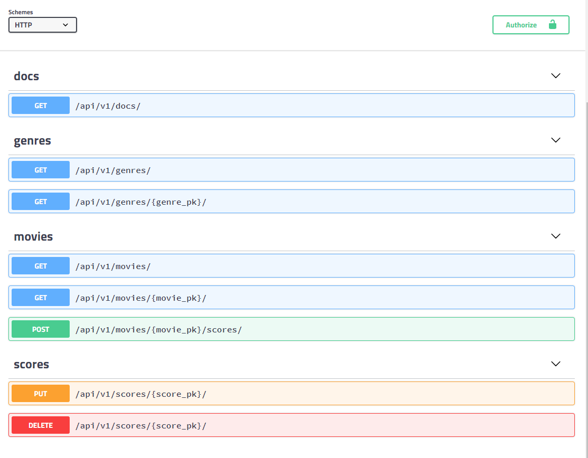

## README

1. 데이터베이스 설계

```python
# models.py in movies app
from django.db import models

# Create your models here.
class Genre(models.Model):
    name = models.CharField(max_length=40)
    
    def __str__(self):		# 목록별 내용 넣기
        return self.name


class Movie(models.Model):
    title = models.CharField(max_length=100)
    audience = models.IntegerField()
    poster_url = models.TextField()
    description = models.TextField()
    genre = models.ForeignKey(Genre, on_delete=models.CASCADE)
    
    def __str__(self):
        return self.title
    
    
class Score(models.Model):
    content = models.TextField()
    score = models.IntegerField()
    movie = models.ForeignKey(Movie, on_delete=models.CASCADE)
```

```bash
./manage.py makemigrations
python manage.py migrate
```


2. Seed Data 반영

   1. 주어진 movie.json 과 genre.json 을 movies/fixtures/ 디렉토리로 옮깁니다.

   2. 아래의 명령어를 통해 반영합니다.

      ```bash
      ./manage.py loaddata genre.json
      ./manage.py loaddata movie.json
      ```

      

   3. admin.py 에 Genre 와 Movie 클래스를 등록한 후, /admin 을 통해 실제로 데이터베이스에 반영되었는지 확인해봅시다.

      ```python
      # admin.py in movies app
      from .models import Genre, Movie
      
      # Register your models here.
      admin.site.register(Genre)
      admin.site.register(Movie)
      ```

      ```bash
      ./manage.py createsuperuser
      ```

      

3. movies API

   * 아래와 같은 API 요청을 보낼 수 있는 서버를 구축해야 합니다.

     ```bash
     pip install djangorestframework		# api 기능 구현을 위한 라이브러리 설치.
     ```

     ```python
     # settings.py 
     INSTALLED_APPS = [
         'rest_framework',
     ]   
     ```

     

   * 허용된 HTTP 요청을 제외하고는 모두 405 Method Not Allowed를 응답합니다.
     api_view에 잘못된 요청을 보내면 뜨는 오류.

   * 

   1. GET /api/v1/genres/

      ```python
      # urls.py in project10 folder
      from django.urls import path, include
      
      urlpatterns = [
          path('api/v1/', include('movies.urls')),
      ]
      
      # urls.py in movies app
      from django.urls import path
      from . import views
      
      urlpatterns = [
          path('genres/', views.genre_list),
          ]
      # serializers.py in movies app
      from rest_framework import serializers
      from .models import Genre
      
      class GenreSerializer(serializers.ModelSerializer):
          class Meta:
              model = Genre
              fields = ['id', 'name']
      
      # views.py in movies app
      from .models import Genre
      from rest_framework.decorators import api_view
      from rest_framework.response import Response
      from .serializers import GenreSerializer
      
      # Create your views here.
      @api_view(['GET'])
      def genre_list(request):
          genres = Genre.objects.all()
          serializers = GenreSerializer(genres, many = True)  
          # 여러개가 들어가도 괜찮아~!
          return Response(serializers.data)
      ```

      

   2. GET /api/v1/genres/{genre_pk}
      만약, 없는 경로 변수(genre_pk)로 접근하는 경우 404 Not Found 에러를 응답합니다.
      
      ```python
      # models.py in movies app
      class Movie(models.Model):
          genre = models.ForeignKey(related_name = 'movies') # related_name
          
      # urls.py in movies app
      urlpatterns = [
          path('genres/<int:genre_pk>/', views.genre_detail)
          ]
      
      # serializers.py in movies app
      from .models import Genre, Movie
      
      class MovieSerializer(serializers.ModelSerializer):
          class Meta:
              model = Movie
              fields = ['id', 'title', 'audience', 'poster_url', 'description', 'genre']
              
      class GenreDetailSerializer(serializers.ModelSerializer):
          movies = MovieSerializer(many = True)
          class Meta:
              model = Genre
              fields = ['id', 'movies', 'name']
              
      # views.py in movies app
      from django.shortcuts import render, get_object_or_404
      from .serializers import GenreSerializer, GenreDetailSerializer
      
      @api_view(['GET'])    
      def genre_detail(request, genre_pk):
          genre = get_object_or_404(Genre, id = genre_pk)
          serializers = GenreDetailSerializer(genre)
          return Response(serializers.data)
      ```
      
      
      
   3. GET /api/v1/movies/

      ```python
      # urls.py in movies app
      path('movies/', views.movie_list),
      
      # views.py in movies app
      from .models import Genre, Movie
      from .serializers import GenreSerializer, GenreDetailSerializer, MovieSerializer
      
      @api_view(['GET'])
      def movie_list(request):
          movies = Movie.objects.all()
          serializers = MovieSerializer(movies, many = True)
          return Response(serializers.data)
      ```

      

   4. GET /api/v1/movies/{movie_pk}
      만약, 없는 경로 변수(movie_pk)로 접근하는 경우 404 Not Found 에러를 응답합니다.

      ```python
      # urls.py in movies app
      path('movies/<int:movie_pk>/', views.movie_detail),
      
      # views.py in movies app
      @api_view(['GET'])
      def movie_detail(request, movie_pk):
          movie = get_object_or_404(Movie, id = movie_pk)
          serializers = MovieSerializer(movie)
          return Response(serializers.data)
      ```

      

   5. POST /api/v1/movies/{movie_pk}/scores/만약, 없는 경로 변수(movie_pk)로 접근하는 경우 404 Not Found 에러를 응답합니다.
      필수 필드가 누락된 경우 400 Bad Request 에러를 응답합니다.

      ```python
      # urls.py in movies app
      path('movies/<int:movie_pk>/scores/', views.score_create),
      
      # serializers.py in movies app
      class ScoreSerializer(serializers.ModelSerializer):
          class Meta:
              model = Score
              fields = ['id', 'content', 'score']
              
      # views.py in movies app
      from .serializers import GenreSerializer, GenreDetailSerializer, MovieSerializer, ScoreSerializer
      
      @api_view(['POST'])
      def score_create(request, movie_pk):
          serializers = ScoreSerializer(data = request.data)
          if serializers.is_valid(raise_exception=True):
              serializers.save(movie_id = movie_pk)   # save 메소드는 실제 데이터 베이스에 저장 되기 때문에 앞 변수가 model에 존재하는 column이어야 한다.
              return Response({"message":"작성되었습니다."})
      ```

      

   6. PUT /api/v1/scores/{score_pk}만약, 없는 경로 변수(score_pk)로 접근하는 경우 404 Not Found 에러를 응답합니다.
      필수 필드가 누락된 경우 400 Bad Request 에러를 응답합니다.

      ```python
      # urls.py in movies app
      path('scores/<int:score_pk>/', views.score_update_and_delete),
      
      # views.py in movies app
      from .models import Genre, Movie, Score
      
      @api_view(['PUT', 'DELETE'])
      def score_update_and_delete(request, score_pk):
          score = get_object_or_404(Score, id = score_pk)
          if request.method == 'PUT':
              serializers = ScoreSerializer(data = request.data, instance = score)
              if serializers.is_valid(raise_exception=True):
                  serializers.save()
                  return Response({"message":"수정되었습니다."})
          else:
              score.delete()
              return Response({"message":"삭제되었습니다."})
      ```

      

   7. DELETE /api/v1/scores/{score_pk}
      만약, 없는 경로 변수(score_pk)로 접근하는 경우 404 Not Found 에러를 응답합니다.

      위 항목에 포함.

4. API documents
    작성한 API 서버의 가능한 요청 사항과 메서드/경로/경로변수를 테스트 할 수 있는 documents를 구성하여 스크린샷을 제출합니다.

  ```bash
   pip install django-rest-swagger
  ```

  ```python
  # settings.py
  'rest_framework_swagger',
  
  # urls.py
  from rest_framework_swagger import get_swagger_view
  ```

  

